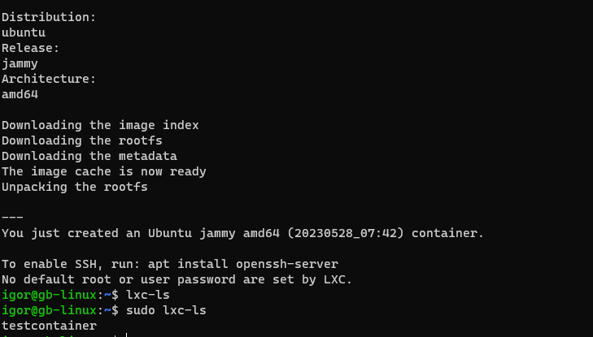
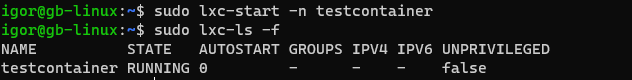
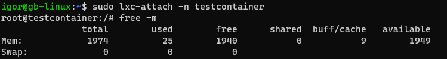
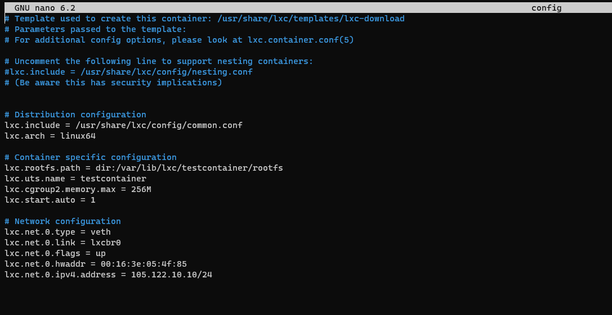
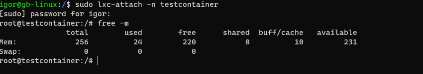
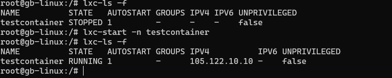

## Задание 1:
1. запустить контейнер с ubuntu, используя механизм LXC

* igor@gb-linux:~$ sudo lxc-create -n testcontainer -t download

2. ограничить контейнер 256 Мб ОЗУ и проверить, что ограничение работает

3. добавить автозапуск контейнеру, перезагрузить ОС и убедиться, что контейнер действительно запустился самостоятельно

4. при создании указать файл, куда записывать логи

root@gb-linux:/# lxc-start -n testcontainer --logfile /logfile.log

lxc-start: testcontainer: tools/lxc_start.c: main: 256 Container is already running

root@gb-linux:/# lxc-start -n testcontainer --logfile /logfile.log -l debug

lxc-start: testcontainer: tools/lxc_start.c: main: 256 Container is already running

5. после перезагрузки проанализировать логи
